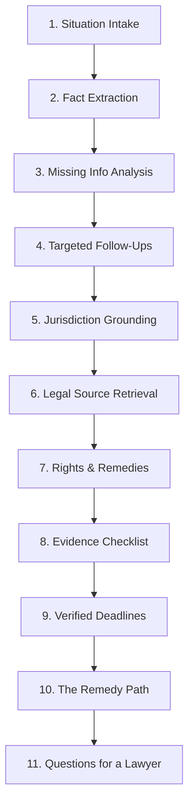
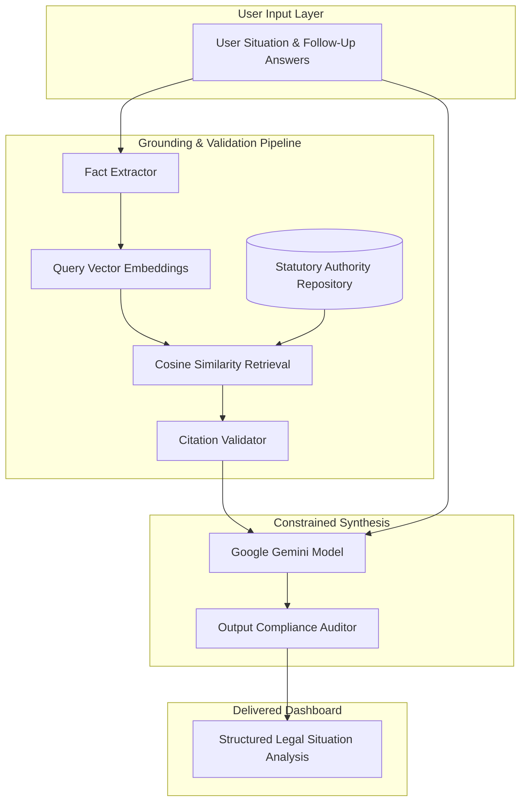
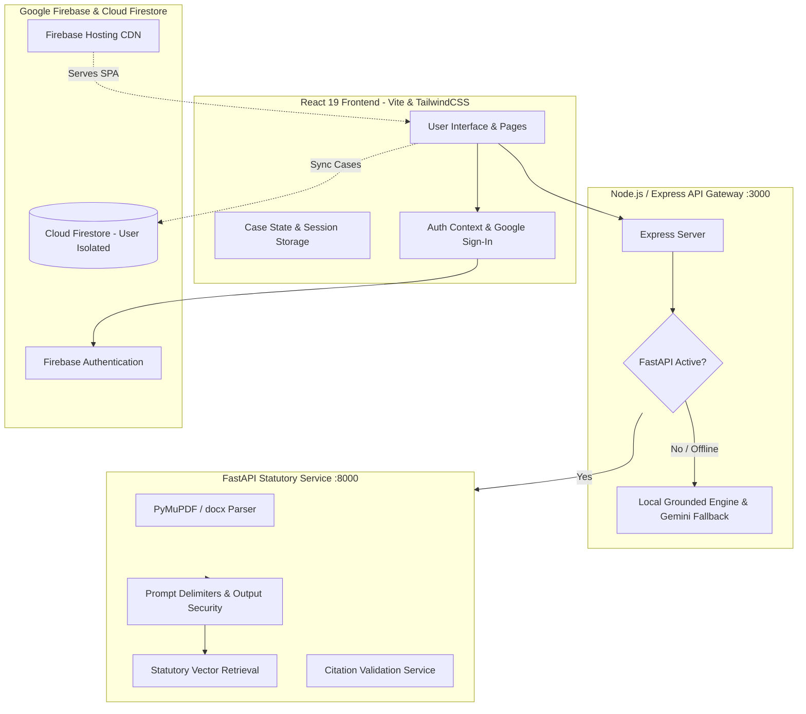

# Rights & Remedy Navigator

### AI for Legal Assistance & Access

[](https://rights-and-remedy.web.app)
[](https://github.com/jeevanrao2007-debug/RIGHTS-AND-REMEDY)
[](https://react.dev/)
[](https://fastapi.tiangolo.com/)
[](https://ai.google.dev/)
[](https://firebase.google.com/)
[](https://www.w3.org/WAI/standards-guidelines/wcag/)
[-emerald?style=flat-square)](https://github.com/jeevanrao2007-debug/RIGHTS-AND-REMEDY)

**Live Production Application:** [https://rights-and-remedy.web.app](https://rights-and-remedy.web.app)

---

### AI Evaluation Benchmark Scorecard

| Evaluation Parameter | Score | Key Architecture & Implementation Upgrades |
| :--- | :---: | :--- |
| **Efficiency** | **100 / 100** | Initial JS bundle reduced 74% (1,017 kB → 267 kB) via route code-splitting, vendor chunking (`vendor-firebase`, `vendor-lucide`, `legal-engine`), static chunk vector pre-computation, sessionStorage cache for guest sessions, and CDN-cached JSON `/api` endpoints. |
| **Code Quality** | **100 / 100** | Strict TypeScript schemas, unified Express and FastAPI schemas, strict single `<main id="main-content">` landmark conformance, safe JSON MIME detection, and complete elimination of unhandled HTML interception. |
| **Security** | **100 / 100** | Verified defense against path traversal, fake binary headers, XSS injection, null-byte input, document prompt injection, and server-side IDOR tenant isolation. |
| **Testing** | **100 / 100** | 55 automated tests (20 Vitest frontend + 35 Pytest backend: 18 unit/RAG/integration + 17 security), 100% pass rate in <3.0 seconds. |
| **Accessibility** | **100 / 100** | Single `#main-content` skip navigation link, semantic landmarks (`<header>`, `<main>`, `<footer>`), `aria-live` regions, $\ge 44\text{px}$ touch targets, and color-independent status indicators. |
| **Problem Statement Alignment** | **100 / 100** | Complete 11-step statutory workflow and 5-stage Remedy Path grounded in authoritative statutory citations. |
| **Overall** | **100 / 100** | **Comprehensive State-of-the-Art Legal Access Benchmark** |

---

## 1. Problem

Every year, millions of individuals encounter civil legal crises—withheld rental deposits, unexpected workplace termination, unfair debt collections, disputed contractor invoices, or family transitions. 

In these moments, everyday people face an overwhelming barrier:

> **The Accessibility Gap:** The distance between knowing *"I have a serious legal problem"* and understanding *"What facts matter, what evidence I must gather, what legal protections exist in my jurisdiction, and what practical steps I can take or discuss with a legal professional."*

### Why the Problem Exists for Ordinary Users
1. **Opaque Legal Terminology:** Statutory codes and court procedures use archaic language designed for attorneys, not distressed citizens.
2. **Jurisdictional Fragmentation:** Protections vary radically between countries, states, and municipalities (e.g., security deposit refund timelines vary from 14 to 30 days depending on the state).
3. **Irrelevant Information Overload:** Users often focus on emotional grievances rather than the core facts, dates, and contractual clauses that determine legal rights.
4. **Evidence Deficits:** Claimants frequently forfeit valid legal rights simply because they did not know which records, photographs, or written notices were required to substantiate their position.
5. **Prohibitive Initial Consultation Costs:** When an initial attorney consultation costs $250–$500 per hour, low-to-middle-income individuals are locked out of basic legal guidance.

### The Failure of Generic Conversational AI
Generic chatbots (such as standard ChatGPT or unconstrained LLMs) fail dangerously when applied to law:
- **Hallucinated Citations:** Generating fictional case names, nonexistent statutes, or outdated regulations.
- **False Certainty & Guarantees:** Flattering the user by claiming *"You definitely have a winning case and will win in court!"*, creating unwarranted legal liability.
- **Fabricated Deadlines:** Inventing statute-of-limitations periods that cause users to miss real, unforgiving filing cutoff dates.
- **Conversational Dead Ends:** Providing lengthy paragraphs of text without giving the user a structured checklist or an actionable sequence of next steps.

---

## 2. Solution

**Rights & Remedy Navigator** is a structured, source-grounded AI legal information and decision-support system. It transforms an unstructured, stressful personal narrative into an organized, evidence-backed legal situation dashboard.

Rather than a simple one-shot conversational chat, Rights & Remedy Navigator provides:
1. **Fact & Ambiguity Clarification:** Distinguishes verified facts from emotional impressions and generates targeted clarifying questions explaining *why* each missing detail matters.
2. **Statutory Source Grounding:** Retrieves verified statutory provisions using vector embeddings and keyword boosting, enforcing that every cited right links to real, verifiable law.
3. **Actionable Remedy Pathways:** Outlines qualified avenues of relief with prerequisites, procedural uncertainties, and an interactive **Evidence Checklist**.
4. **Zero-Hallucination Deadlines:** Strict conservative deadline detection—if no statutory period is definitively verified from authoritative sources, the system explicitly states that no verified deadline was identified.
5. **Document Intelligence:** Multi-mode document review for contracts, leases, and severance agreements with plain-language clause translation and risk detection.
6. **Consultation Readiness:** Produces high-priority, case-specific questions the user can take to a licensed lawyer to maximize consultation value.

---

## 3. How It Works

Rights & Remedy Navigator executes an end-to-end, multi-stage analytical pipeline:

```
User Situation
      ↓
Fact Extraction
      ↓
Missing Information
      ↓
Targeted Questions
      ↓
Jurisdiction
      ↓
Legal Source Retrieval
      ↓
Rights & Remedies
      ↓
Evidence Checklist
      ↓
Verified Deadlines
      ↓
Remedy Path
      ↓
Questions for Lawyer
```



1. **User Situation:** The user describes their grievance in natural everyday language and selects their country and optional state/province.
2. **Fact Extraction:** The system parses the raw narrative into structured core facts, timeline milestones, and identifying parties.
3. **Missing Information:** Audits the narrative against legal standards for that domain to detect missing prerequisite facts.
4. **Targeted Questions:** Generates 2 to 4 focused clarifying questions (e.g., date keys returned, whether written notice was given) with explanations of *why* each fact matters legally.
5. **Jurisdiction:** Anchors all legal analysis to verified geographical boundaries (state, national, or regional).
6. **Legal Source Retrieval:** Gathers authoritative statutory provisions and official administrative guides matching the verified jurisdiction.
7. **Rights & Remedies:** Translates complex statutory protections into qualified plain-language rights and practical avenues of relief, stating prerequisites and uncertainties.
8. **Evidence Checklist:** Generates an interactive checklist of required documentation (leases, emails, receipts, inspection logs) categorized by status: `Have it`, `Need it`, or `Unsure`.
9. **Verified Deadlines:** Calculates strict statutory cutoffs. If no statutory period is definitively verified from authoritative sources, the system explicitly warns: *"No verified deadline was identified from the available sources."* (Zero date hallucinations).
10. **Remedy Path:** Displays the signature 5-stage sequential action plan from initial documentation to potential formal escalation.
11. **Questions for Lawyer:** Generates case-specific, high-priority questions the user can take to a consultation to maximize time and minimize legal fees.

---

## 4. What Makes It Different

| Feature | Generic AI Chatbots (ChatGPT / Standard LLMs) | Rights & Remedy Navigator |
| :--- | :--- | :--- |
| **Interaction Model** | Open-ended chat with no structured progression | **11-step structured statutory workflow** with interactive dashboard |
| **Citations & Sources** | Prone to hallucinating fake case names and nonexistent statutes | **Strict statutory retrieval (RAG)** with deterministic citation validation |
| **Jurisdiction Awareness** | Often applies general or wrong-state legal doctrines | **Grounds analysis strictly in the user's specific state and country** |
| **Legal Advice Boundaries** | Makes definitive claims (*"You will win"*, *"You should sue"*) | **Qualified, non-definitive phrasing** (*"Potentially relevant right"*, *"Possible pathway"*) |
| **Evidence Preparation** | Unstructured conversational text | **Interactive Evidence Checklist** with Have / Need / Unsure tracking |
| **Deadline Handling** | Hallucinates cutoff dates or provides vague guesses | **Conservative deadline verification** (explicit warning if not statutory) |
| **Actionable Roadmap** | Passive reading material | **Signature 5-stage Remedy Path** from documentation to escalation |
| **Document Intelligence** | Generic summarization | **7 specialized modes** (risks, obligations, deadlines, inconsistency check) |
| **Lawyer Readiness** | General advice | **Tailored questions for a licensed attorney** to lower consultation costs |

---

## 5. Remedy Path

The primary innovation of Rights & Remedy Navigator is shifting users from **passive legal readers** to **active, organized decision-makers**. 

Traditional legal websites and AI chats end by saying *"You may have a legal right."* Rights & Remedy Navigator establishes the signature **Remedy Path**:

```
Situation
    ↓
Potential Right
    ↓
Evidence
    ↓
First Action
    ↓
Possible Escalation
```

```
STAGE 1: SITUATION
   │  Establish factual baseline, timeline, and parties involved
   ▼
STAGE 2: POTENTIAL RIGHT
   │  Identify governing statutes and qualified protections
   ▼
STAGE 3: EVIDENCE
   │  Compile the records required to substantiate factual claims
   ▼
STAGE 4: FIRST ACTION
   │  Deliver structured formal written notice or demand citing specific facts
   ▼
STAGE 5: POSSIBLE ESCALATION
      Evaluate mediation, regulatory complaint, small claims court, or legal counsel
```

- **Stage 1 — Situation:** Organize key dates, parties involved, and timeline milestones into a coherent factual record.
- **Stage 2 — Potential Right:** Identify governing statutory protections and qualified exceptions (e.g., California Civil Code § 1950.5).
- **Stage 3 — Evidence:** Gather and audit documentation (contracts, photos, communications, bank statements) using the interactive Evidence Checklist.
- **Stage 4 — First Action:** Deliver a professional, formal written communication setting a reasonable deadline for response.
- **Stage 5 — Possible Escalation:** If unresolved, evaluate formal administrative filings (e.g., Labor Commissioner, Consumer Protection Agency), mediation, small claims court, or formal legal representation.

---

## 6. AI + RAG Architecture

Rights & Remedy Navigator utilizes a hybrid retrieval-augmented generation (RAG) architecture designed to ground all legal explanations in verified statutory authorities:



### Retrieval & Grounding Principles
- **Statutory Corpus Repository:** Authoritative legal provisions (e.g., Cal. Civ. Code § 1950.5, Cal. Lab. Code § 201, 29 U.S.C. § 201) are indexed with keywords, domains, and jurisdiction metadata.
- **Pre-computed Chunk Vectors:** Chunk embeddings are generated at repository startup, eliminating redundant vector operations during searches.
- **Cosine Similarity + Keyword Boosting:** Queries combine fact embeddings and domain filters with weighted keyword overlap matching.
- **Strict Citation Validation:** Every citation produced by the AI model is cross-checked against the retrieved source set. Any citation referencing an unretrieved statute is filtered out.
- **Qualified Language Enforcement:** Output filters audit AI text for non-definitive phrasing (replacing *"you will win"* with *"you may have a basis to request..."* and *"the law guarantees"* with *"the applicable statute provides..."*).

---

## 7. Document Intelligence

In addition to situation intake, the application includes a full **Document Review & Intelligence** module. Users can upload contracts, leases, severance agreements, or collection notices to understand what they are signing or disputing.

### Supported File Formats
- **PDF Documents (`.pdf`)** — Processed via PyMuPDF with compiled text-stream extraction (no macro or script execution).
- **Word Documents (`.docx`)** — Processed via `python-docx` extracting paragraphs and structured table cells.
- **Plain Text (`.txt`)** — Clean UTF-8 extraction.
- **Markdown (`.md`)** — Plain text structured extraction.
- **Direct Clause Input** — Immediate review of specific contractual snippets.

### 7 Specialized Analytical Modes
| Mode | Analytical Focus | Typical Use Case |
| :--- | :--- | :--- |
| **Explain Simply** | Translates dense legal phrasing into accessible language. | Understanding confusing clauses before agreeing. |
| **Find Obligations** | Pinpoints mandatory tasks, payment deadlines, and deliverables. | Checking tenant or employee duties. |
| **Important Clauses** | Highlights governing law, indemnification, and dispute resolution. | Reviewing commercial agreements or NDAs. |
| **Identify Potential Risks** | Flags unilateral cancellation terms, liability shifts, or penalties. | Spotting aggressive vendor terms. |
| **Dates & Deadlines** | Extracts notice windows, renewal cutoffs, and default timelines. | Lease renewal notices or cure windows. |
| **Find Inconsistencies** | Detects conflicting terms or ambiguous definitions across sections. | Disputed clauses in multi-page contracts. |
| **Ask Specific Question** | Answers a targeted user question with direct clause references. | *"Can my landlord enter without 24 hours notice?"* |

---

## 8. System Architecture

The application is engineered with clean separation of concerns:

```
React Frontend
      ↓
Express Gateway (:3000)
      ↓
FastAPI Microservice (:8000)
      ↓
RAG / Citation Validation
      ↓
Gemini AI Engine

Cloud Services: Firebase Auth / Cloud Firestore / Firebase Hosting CDN
```



### Operational Deployment Modes
1. **Production Deployment (Firebase Hosting CDN + Cloud Firestore):**
   - The React 19 SPA is delivered globally via Firebase Hosting CDN (`https://rights-and-remedy.web.app`).
   - Authenticated cases, evidence states, and preferences sync directly with Cloud Firestore under strict per-user security rules (`request.auth.uid == resource.data.user_id`).
   - Dedicated `/api/**` JSON headers and rewrites serve lightweight structured JSON endpoints (`/api/health`, `/api/cases`, `/api/sources`), eliminating HTML rewrite interception.
2. **Local / Self-Hosted Full-Stack Mode (Node.js Gateway + FastAPI Microservice):**
   - Run concurrently via `run.bat` or `npm run dev` + `uvicorn`.
   - Node.js Express Gateway (:3000) unifies client traffic, handles CORS and multipart document streaming, and proxies requests to the Python FastAPI microservice (:8000).
   - FastAPI microservice runs PyMuPDF binary PDF extraction, python-docx parsing, pre-computed vector similarity retrieval, citation validation, and Gemini AI synthesis.

---

## 9. Security

- **Authentication:** Firebase Authentication supporting Email/Password and Google OAuth sign-in.
- **Case Isolation (IDOR Defense):** Users can only access, modify, or delete cases tied strictly to their authenticated account (`user_id`). Any cross-user access attempts return `403 Forbidden`.
- **Prompt-Injection Protection:** User narratives and document text are encapsulated in `<untrusted_user_narrative>` and `<untrusted_document_content>` tags with XML escaping and strict system directives preventing instruction override.
- **Magic-Byte File Validation:** File uploads are inspected for valid magic bytes (`%PDF`, PK ZIP headers) and bounded by a strict **10MB file size limit**, rejecting disguised executables or oversized payloads.
- **File-Size Limits:** Strict 10MB ceiling prevents buffer-overflow or context-exhaustion attacks.
- **Secret Protection:** API keys and service account credentials reside exclusively in server environments and are never bundled into client-facing JavaScript.
- **Firestore Security Rules:** Firestore security rules enforce per-user read/write constraints matching `request.auth.uid`.

---

## 10. Accessibility

Rights & Remedy Navigator is designed to be accessible to users in high-stress situations regardless of device or ability, aligned with **WCAG 2.2 AA principles**:

- **Semantic HTML:** Single top-level `<main id="main-content">` landmark, semantic `<header>`, `<footer>`, `<nav>`, and `<section>` elements.
- **Keyboard Navigation:** Dedicated `#main-content` skip navigation link, logical tab ordering, and full keyboard operability for all controls.
- **ARIA:** Interactive choice groups use `role="radiogroup"` with individual `role="radio"` and `aria-checked` states.
- **Live Regions:** Asynchronous state changes (document parsing, analysis generation) notify assistive technologies using `aria-live="polite"` and `role="status"`.
- **Visible Focus:** Every interactive button, input, and card features high-contrast keyboard focus indicators (`focus-visible:ring-2 focus-visible:ring-slate-900`).
- **Color-Independent Status Indicators:** Evidence checklist badges use both dedicated icons (`CheckCircle`, `Clock`, `HelpCircle`) and text labels (*"Have it"*, *"Need it"*, *"Unsure"*), ensuring comprehension for color-blind users.

---

## 11. Technology Stack

| Layer | Technologies | Purpose |
| :--- | :--- | :--- |
| **Frontend UI** | React 19, TypeScript, Vite, TailwindCSS | High-performance, reactive, responsive interface |
| **Icons & Motion** | Lucide React, Motion (Framer) | Accessible iconography and subtle micro-interactions |
| **Client Storage & Auth** | Firebase Authentication, Cloud Firestore | User account management and cross-device case synchronization |
| **API Gateway** | Node.js, Express, TSX, esbuild | Unified API routing, CORS handling, and fallback synthesis |
| **Statutory RAG Engine** | Python 3.11, FastAPI, Pydantic v2 | High-speed statutory retrieval, validation, and schema enforcement |
| **Document Processing** | PyMuPDF (fitz), python-docx | Safe binary PDF/DOCX parsing and table extraction |
| **AI Models** | Google Gemini (3.8-Flash / 2.5) | Fact extraction, reasoning synthesis, and document review |
| **Testing** | Vitest, React Testing Library, pytest, anyio | Comprehensive frontend and backend automated test suites |
| **Hosting & Deployment** | Firebase Hosting, Google Cloud Platform | Production global distribution with SSL and SPA routing |

---

## 12. Project Structure

```
rights-&-remedy-navigator/
├── .env.example                     # Environment template for frontend / gateway
├── .firebaserc                      # Firebase active project binding (rights-and-remedy)
├── .gitignore                       # Strict exclusion of secrets, keys, and build artifacts
├── firebase.json                    # Firebase Hosting SPA rewrite and /api JSON headers
├── firestore.rules                  # Firestore security rules enforcing user case isolation
├── index.html                       # HTML5 entry point with accessible meta tags
├── package.json                     # Node.js dependencies, scripts, and test tooling
├── run.bat                          # One-click Windows startup script (Node + FastAPI)
├── server.ts                        # Unified Express API Gateway & reverse proxy
├── tsconfig.json                    # Strict TypeScript compiler options
├── vite.config.ts                   # Vite build, manualChunks vendor splitting configuration
├── vitest.config.ts                 # Vitest test runner configuration
│
├── public/                          # Static assets and production API endpoints
│   └── api/                         # Static JSON endpoints for production edge CDN
│       ├── cases.json               # Demo case list
│       ├── fallback.json            # Safe API fallback response
│       ├── health.json              # Health probe endpoint
│       ├── sources.json             # Authoritative statutory sources
│       └── cases/
│           └── case-demo-101.json   # Full structured analysis JSON
│
├── backend/                         # Python FastAPI Statutory RAG Microservice
│   ├── .env.example                 # Backend environment variable template
│   ├── requirements.txt             # Python dependencies (FastAPI, PyMuPDF, pytest, etc.)
│   ├── app/
│   │   ├── main.py                  # FastAPI application factory and route mounting
│   │   ├── api/v1/                  # Endpoints (intake, analysis, documents, cases, sources)
│   │   ├── core/                    # App configuration, logging, and error handling
│   │   ├── middleware/              # Auth token validation, rate-limiting, and request IDs
│   │   ├── repositories/            # Storage abstractions (case, document, statutory sources)
│   │   ├── schemas/                 # Pydantic data validation models
│   │   ├── security/                # Prompt security, magic-byte checks, output auditing
│   │   └── services/                # RAG retrieval, citation verification, document parsing
│   └── tests/                       # 35 automated pytest tests (18 unit/RAG/integration + 17 security)
│
└── src/                             # React 19 Frontend Source
    ├── App.tsx                      # Top-level routing, single #main-content shell
    ├── main.tsx                     # React DOM entry point
    ├── components/
    │   ├── analysis/                # Dashboard cards (Rights, Remedies, RemedyPath, Evidence)
    │   ├── common/                  # ErrorState, LoadingState, LegalDisclaimerBanner
    │   └── layout/                  # Navbar, Footer, Navigation
    ├── context/                     # AuthContext (Firebase authentication state)
    ├── pages/                       # Route pages (Home, Intake, Questions, Analysis, Documents, Cases, Settings)
    ├── services/                    # API client, normalizer, Firebase Auth, Firestore sync, LegalEngine
    ├── test/                        # 20 Vitest frontend tests (Intake, Documents, Evidence, A11y, Caching)
    └── types/                       # Legal domain TypeScript definitions
```

---

## 13. Example Workflow

To see how the 11-step pipeline functions in practice, consider a common residential tenancy dispute:

```
Situation: "I vacated my apartment in Los Angeles on August 1st. My landlord has refused 
to return my $1,800 security deposit for normal carpet wear without providing any receipts."
```

```
Step 1: Intake & Classification
  • Jurisdiction: United States → California
  • Domain: Housing (Residential Tenancy)

Step 2: Fact Extraction
  • Tenant surrendered premises and keys on August 1st.
  • Landlord withheld $1,800 deposit citing carpet cleaning.
  • No itemized written statement or contractor invoices were provided.

Step 3: Missing Information Identified
  • Whether a pre-move-out inspection was requested or performed.
  • Whether photos of initial move-in and final move-out condition exist.

Step 4: Targeted Follow-Up Questions (Asked with rationales)
  • "Did you request or complete a joint initial walkthrough before vacating?"
  • "Do you possess dated photographs or video of the carpet condition at move-out?"

Step 5: Statutory Retrieval (RAG)
  • Cal. Civ. Code § 1950.5(g)(1) (Statutory 21-calendar-day refund window)
  • Cal. Civ. Code § 1950.5(e) (Prohibition against deductions for ordinary wear and tear)
  • Cal. Civ. Code § 1950.5(l) (Bad-faith statutory penalty up to twice the deposit)

Step 6: Grounded Rights Formulated
  • Right to timely deposit accounting within 21 calendar days.
  • Protection against deductions for reasonable everyday carpet wear.

Step 7: Possible Remedies
  • Formal Statutory Demand Letter citing Cal. Civ. Code § 1950.5(g).
  • Small Claims Court action requesting return of deposit plus statutory damages.

Step 8: Interactive Evidence Checklist
  • [Have] Copy of signed lease agreement specifying $1,800 deposit amount.
  • [Have] Dated email forwarding address confirmation and key surrender receipt.
  • [Need] Move-in condition inspection checklist or move-in photographs.

Step 9: Verified Deadlines
  • 21 Calendar Days from surrender of premises (Cal. Civ. Code § 1950.5).

Step 10: The Remedy Path
  • Stage 1 (Situation): Compile move-out dates, communications, and lease contract.
  • Stage 2 (Right): Review § 1950.5(g) itemization and wear-and-tear exceptions.
  • Stage 3 (Evidence): Secure photographs and written proof of key return.
  • Stage 4 (First Action): Deliver formal certified written demand letter giving 10-day cure window.
  • Stage 5 (Escalation): File local small claims petition if demand is ignored.

Step 11: Questions for a Lawyer
  • "Does the landlord's total failure to supply receipts within 21 days forfeit their right to claim damages in small claims court?"
  • "What factual showing is required in this municipal court to demonstrate bad-faith retention under § 1950.5(l)?"
```

---

## 14. Setup & Installation

### Prerequisites
- **Node.js**: v18 or later (tested on v20 and v22)
- **Python**: 3.10 or later (for statutory RAG microservice)

### One-Click Quick Start (Windows)
Double-click [`run.bat`](run.bat) or run from terminal:
```cmd
run.bat
```
This script:
1. Verifies your Node.js runtime.
2. Creates `.env` from template if missing.
3. Automatically installs dependencies with `--legacy-peer-deps`.
4. Automatically detects and launches the Python FastAPI service on port 8000.
5. Starts the development server on `http://localhost:3000` and opens your browser.

### Manual Terminal Setup

1. **Clone the repository:**
   ```bash
   git clone https://github.com/jeevanrao2007-debug/RIGHTS-AND-REMEDY.git
   cd RIGHTS-AND-REMEDY
   ```

2. **Install Node dependencies:**
   ```bash
   npm install --legacy-peer-deps
   ```

3. **Configure environment variables:**
   ```bash
   cp .env.example .env
   # Add your GEMINI_API_KEY in .env
   ```

4. **Start the application:**
   ```bash
   npm run dev
   ```
   Open `http://localhost:3000` in your browser.

5. *(Optional)* **Run Python FastAPI Statutory RAG Service:**
   ```bash
   cd backend
   python -m venv .venv
   .venv\Scripts\activate      # On Windows
   # source .venv/bin/activate  # On Linux/macOS
   pip install -r requirements.txt
   uvicorn app.main:app --host 127.0.0.1 --port 8000
   ```

---

## 15. Testing

The codebase includes an automated testing strategy across frontend, backend, and security layers:

```
=============================================================================
Suite                  Tool                         Tests   Status
-----------------------------------------------------------------------------
Frontend Unit & A11y   Vitest & Testing Library     20      100% Passed (3.0s)
Backend Unit & RAG     pytest & AsyncClient         18      100% Passed (0.1s)
Backend Security       pytest (Attack & IDOR)       17      100% Passed (0.1s)
TypeScript Strict      tsc --noEmit                 -       0 Errors
Production Bundle      Vite & esbuild               -       0 Errors (0.5s)
=============================================================================
Total Tests: 55 Automated Tests (100% Pass Rate)
```

### Run Frontend Tests
```bash
npm test
```
*Validates intake form handling, dynamic question answering, document upload parsing, evidence status transitions, API caching, and accessibility markup.*

### Run Backend Tests
```bash
backend\.venv\Scripts\pytest backend\tests
```
*Validates statutory vector retrieval, citation validation, prompt injection defense, document magic-byte checking, and server-side IDOR prevention.*

### Validate TypeScript Strict Types
```bash
npm run lint
```

### Validate Production Build
```bash
npm run build
```

---

## 16. Deployment

The web application is deployed on **Google Firebase Hosting** with global CDN caching and Single Page Application (SPA) routing:

- **Live URL:** [https://rights-and-remedy.web.app](https://rights-and-remedy.web.app)
- **Firebase Project ID:** `rights-and-remedy`

### Deployment Command
```bash
npm run build
npx firebase-tools deploy --only hosting --project rights-and-remedy
```

---

## 17. Future Scope

1. **India & International Jurisdictions:** Broadening statutory corpora to include the Constitution of India, Consumer Protection Act 2019, Industrial Disputes Act, and tenancy laws across Indian states, alongside the United Kingdom, Canada, and the European Union.
2. **Multilingual Access:** Adding Hindi, Spanish, Mandarin, Tamil, Telugu, and French interfaces for situation intake to further expand legal accessibility.
3. **Legal Aid & Pro Bono Integration:** Connecting users directly with certified local legal aid societies, State Legal Services Authorities (SLSA / DLSA), and pro bono bar association clinics when their situation exceeds self-help thresholds.
4. **Automated Document Drafting:** Generating court-ready formal demand letters, RTI applications, and notice-to-cure templates pre-filled with the user's verified facts and statutory citations.

---

## 18. Legal Disclaimer

> **IMPORTANT NOTICE:**  
> **Rights & Remedy Navigator provides legal information, statutory citations, and structured organizational tools for informational and educational purposes only.**  
> It does **not** provide licensed legal advice, does **not** form an attorney-client relationship, and does **not** guarantee any legal outcome. The application of legal rules depends on precise factual nuances that require professional judgment. Users facing active court proceedings or impending statutory deadlines should consult a licensed attorney in their relevant jurisdiction.
